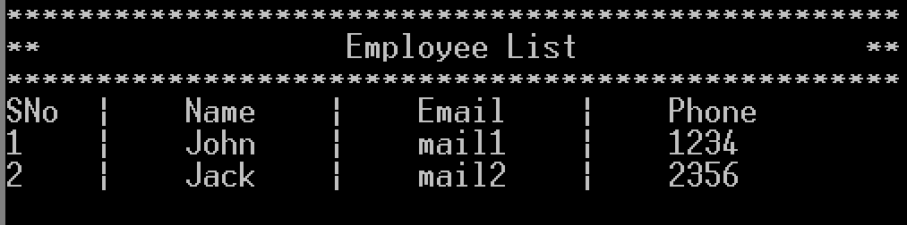

# 8086 Assembly Employee Management System

This project is a simple **Employee Management** application built using **8086 Assembly Language.**

## Preview





## Features

- **User Authentication**: Login page to authenticate users before accessing the application.
- **Operations**:
  - **Create**: Add new employee records.
  - **Read**: Show all existing records.
  - **Delete**: Remove last added record (similar to stack operstion).
- **Logout**: Users can temporarily log out of the application.

## Technologies Used

- **Programming Language**: 8086 Assembly
- **Emulator**: Emu8086

## Setup Instructions

1. **Setup Environment**:
    <br/>
    To run this application, you need to have the following installed on your system:
    - **Emutaor** - Emu8086 or similar 8086 emulator

    <br/>

    or

    <br/>

    - **VS Code Extension** - MASM/TASM

2. **Clone the Repository**:
   ```bash
   git clone https://github.com/taher-dev/8086-Assembly-Employee-Management-System.git
   ```
   or
   <br/>
   download or copy the code from **ems.asm** file in the repository.
3. **Run Program**: 
<br/>
Run the ems.asm program.